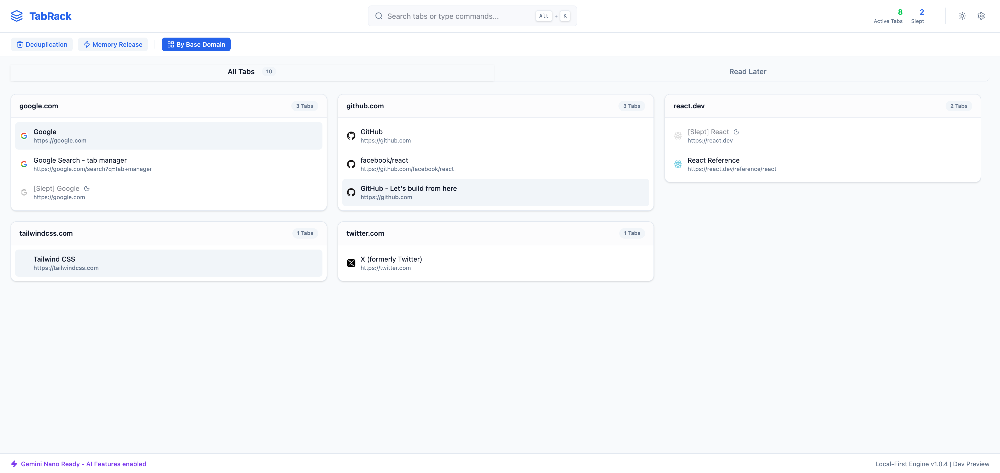

<div align="center">

# 🗄️ TabRack

**A smart browser tab manager featuring domain grouping, read-later archiving, and AI tracking & summarization.**

[](#english-documentation)
[](#中文文档)

<br/>

<br/>

</div>

---

<div id="english-documentation"></div>

# TabRack (English)

TabRack is a next-generation browser tab manager that helps you tame tab overload with robust privacy. With a clean interface, local data storage (no mandatory cloud sync), and an intelligent AI categorization & summarization engine powered by your choice of local AI (Gemini Nano) or Cloud API (Gemini/OpenAI), it provides a blazing-fast experience to organize, discard, and read tabs later.

## ✨ Key Features

- **🌐 Smart Domain Grouping:** Instantly group chaotic tabs by their respective domains with one click.
- **✂️ Keep Exactly One Tab:** Too many repetitive searches? Quickly trim duplicate tabs of the same domain with a single click of the "scissors" icon, keeping only the most recently active one.
- **⚡ AI Auto-Summary:** Click the Sparkles (⚡) icon on any open tab to let your chosen AI model instantly extract its core summary. You can also generate summaries for any article saved in your Read Later list! Powered by your choice of local Chrome Nano or Cloud APIs.
- **🧹 Instant Deduplication Radar:** Automatically scans open tabs, stripping away tracking parameters (`utm_source`, etc.) to find true duplicates.
- **🔍 Live Search & Filter:** A powerful search bar to instantly find any tab by title or URL across all your open windows.
- **🧠 Memory Release:** A built-in "Discard" feature forces inactive tabs to sleep, immediately freeing RAM.
- **📖 Read Later (Read & Burn):** Save tabs you don't have time for into a local IndexedDB list and automatically close them. Now features a **Double Interception Valve** with URL normalization to strip tracking parameters ensuring you never save exact duplicates. Clicking the extension icon in your browser toolbar or the Bookmark (`🔖`) icon on the tab instantly saves the current tab to Read Later and clears it out of your way.

## 🚀 Usage Guide

1. **Top Action Bar:**
   - **One-Click Dedupe:** Click to scan for duplicate tabs and selectively close them.
   - **Release Memory:** Instantly puts all your inactive tabs into "sleep" mode to save RAM.
   - **Domain Grouping:** Toggle to switch between grouping tabs by "Window" or by "Domain".

2. **Managing Domain Groups (When Domain Grouping is ON):**
   - Hover over a domain group header to see quick actions.
   - Click the **red Trash icon** to close all tabs from that site.
   - Click the **Scissors icon** to intelligently auto-close all but the most relevant/most recent tab.

3. **Managing Individual Tabs:**
   - **Switch:** Click the external link icon to instantly jump to that tab.
   - **AI Summary:** Click to let the configured AI engine generate a summary of the tab context.
   - **Read Later:** Save the link to your offline reading list. **Pro Tip:** Pin the TabRack icon to your browser toolbar—clicking it will instantly send the current page to Read Later and close the tab!

## 📥 Install from Releases (Easiest)

1. Go to the [Releases](../../releases) page of this repository.
2. Download the latest `tabrack-extension.zip` file attached to the release.
3. Extract the downloaded `.zip` file to a folder on your computer.
4. Open your browser and navigate to the extensions page (e.g., `chrome://extensions`).
5. Enable **Developer mode** in the top right corner.
6. Click the **"Load unpacked"** button in the top left and select the folder you just extracted.
7. Pin TabRack to your toolbar and enjoy!

## 📦 Build & Load Extension Locally

**Prerequisites:** Ensure you have [Node.js](https://nodejs.org/) and `npm` installed on your machine.

1. **Install dependencies & build the project:**
   Run the following commands in your terminal to install required packages and build the extension.
   ```bash
   npm install
   npm run build
   ```
2. **Load into Chrome/Edge/Brave:**
   - Open your browser and navigate to the extensions page (e.g., `chrome://extensions`).
   - Enable **Developer mode** in the top right corner.
   - Click the **"Load unpacked"** button in the top left.
   - Select the `dist` folder generated from the build step located in the project's root directory.
3. **Pin and Use:**
   - Pin TabRack to your toolbar. Clicking it will save the current tab to Read Later! TabRack will also act as your default "New Tab" page, giving you an immersive full-screen management center.

---
</div>

<div id="中文文档" style="margin-top: 50px;"></div>

# TabRack (简体中文)

TabRack 是一款下一代浏览器标签页管理器，专为解决“标签页灾难”而生。它采用保护隐私的设计原则构建，绝不强制向云端同步您的浏览记录。同时，它不仅前沿地集成了 Chrome 浏览器即将全面内置的端侧大模型接口 (`window.ai` / Gemini Nano)，还在设置里支持了各种主流云端大模型（Gemini API / 兼容 OpenAI 格式 API）的选择，为您提供极速的网页智能归类、长文一键总结与空间清理体验。

## ✨ 核心特性

- **🌐 域名智能聚合：** 一键开启按域名 (Domain) 聚合模式，立刻将散落各处的相似网页整理打包。
- **✂️ 精确“仅保留一个”：** 查资料时同网站页面开了几十个？在域名分组标题栏点击“小剪刀”图标，系统会利用算法（活跃状态 > 未休眠 > 创建时间）智能挑选出最优标签留下，其余瞬间斩断。
- **⚡ AI 智能提取与全文摘要：** 点击标签页上的魔法/闪电图标 (⚡) 即可调用配置的 AI 引擎为您提取网页的核心内容与摘要；在“稍后阅读”列表中，您同样可以让大模型为您**一键生成长文摘要**！（支持本地端侧大模型及各家云端 API）
- **🧹 一键去重雷达：** 自动跨窗口扫描重复打开的网页，底层拥有强大的洗链功能，能无视 `utm` 等追踪后缀，找出真正的重复项。
- **🔍 极速全局搜索：** 顶部的全局搜索框支持模糊匹配跨所有窗口的网页标题和 URL。
- **🧠 强制释放内存：** “释放内存”功能可瞬间让所有在后台装死的标签页强制进入休眠状态，拯救你的设备运存。
- **📖 稍后阅读 (阅后即焚 & 严格去重)：** 遇到长文？直接点击右上角的 TabRack 扩展图标，或者在控制台点击书签 (`🔖`) 图标，当前页面立刻存入你本地的 IndexedDB 数据库并自动关闭。内置了 **URL 深度清洗与双重去重拦截**，绝不存重复文章，再次添加只会静默刷新你的存入时间。

## 🚀 使用指南

1. **顶部核心操作栏：**
   - **一键去重：** 点击即可唤出去重面板，全景审视并勾选关闭重复页面。
   - **释放内存：** 立刻休眠非活动窗口，快速抢救电脑内存。
   - **域名聚合：** 切换“按所在窗口”或“按域名属性”来重组标签页列表视角。

2. **聚合领域管理 (当开启域名聚合时)：**
   - 鼠标悬停在聚合面板标题栏右侧。
   - 点击 **红色垃圾桶**：秒杀当前网站的所有标签页。
   - 点击 **小剪刀**：清理组内多余标签，系统懂事地帮你只“保留一个”最佳候选人。

3. **单标签极速交互：**
   - **跳转：** 点击对应箭头图标，跨窗口直接切走。
   - **AI 智能摘要：** 让配置的 AI 引擎提取该网页的核心要点和摘要。
   - **稍后阅读：** 保存网页同时立刻关闭当前选项卡。**高阶用法：** 固定 TabRack 图标到浏览器右上角，冲浪时遇到来不及看的网页，直接痛快地点击图标，文章立马收纳并自动关掉网页！

## 📥 从 Release 下载安装 (最推荐)

1. 前往本仓库的 [Releases 发布页](../../releases)。
2. 下载最新版本下附带的 `tabrack-extension.zip` 压缩包。
3. 将下载的压缩包解压到您电脑上的任意文件夹中（请不要删除该解压后的文件夹）。
4. 在浏览器地址栏输入 `chrome://extensions` 打开扩展程序管理页面。
5. 开启页面右上角的 **开发者模式 (Developer mode)**。
6. 点击左上角的 **加载已解压的扩展程序 (Load unpacked)**，然后选择您刚刚解压的那个文件夹目录。
7. 在浏览器工具栏固定 TabRack，即可开始使用！

## 📦 自行打包与安装 (Chrome 扩展)

**环境依赖：** 请确保您的系统已安装 [Node.js](https://nodejs.org/) 与 `npm`。

1. **安装依赖并打包构建：**
   在项目根目录下打开终端，依次运行以下命令安装所需依赖项并进行打包：
   ```bash
   npm install
   npm run build
   ```
2. **加载到浏览器 (Chrome/Edge 等)：**
   - 在浏览器地址栏输入 `chrome://extensions` 打开扩展程序管理页面。
   - 开启页面右上角的 **开发者模式 (Developer mode)**。
   - 点击左上角的 **加载已解压的扩展程序 (Load unpacked)**。
   - 选择项目目录下刚刚构建生成的 `dist` 文件夹（它包含了浏览器所需的 manifest 与静态资源）。
3. **固定并使用：**
   - 极度建议在浏览器工具栏处固定 TabRack 图标。遇到稍长来不及看的文章只需点击一下扩展图标，当前页面即可被一键收录进“稍后阅读”并自动关闭释放内存！同时它也会接管您的“新建标签页 (New Tab)”以提供沉浸式的全屏管理体验。

---
</div>

> **Note / 注意**: When "Gemini Nano (Local Chrome)" is selected, AI Summarization currently falls back to a smart mock engine containing keywords matching inside standard browser environments unless the experimental `#prompt-api-for-gemini-nano` flag is enabled via Chrome flags. Use the Cloud API options in settings for immediate access in any browser. / 当选择“Gemini Nano（本地端侧模式）”时，若标准浏览器的 Chrome 原生大模型实验 Flag 未开启，AI 摘要会暂时降级使用一套本地全真模拟语义引擎。您可以随时在设置中切换为“云端 API (Cloud API)”模型以在任何浏览器获得立刻的满血体验。
